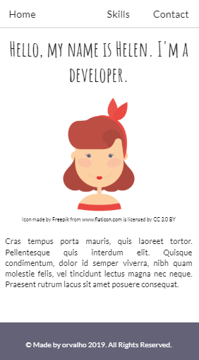
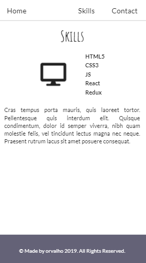
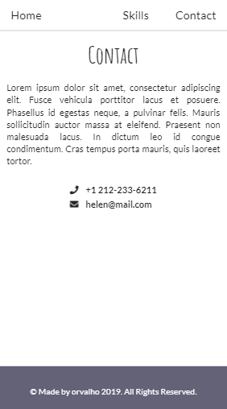
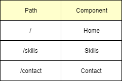
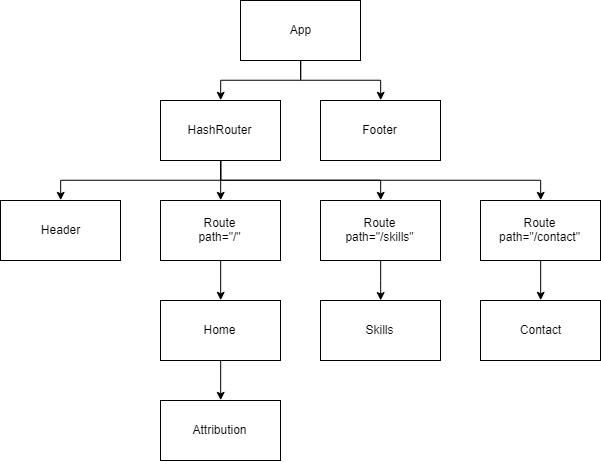

## Personal website

Practicing how to handle navigation using React Router. 
The challenge - to be able to navigate around to separate pages in the app. 
This is a personal website with three pages: Home, Skills and Contact.

#### App

##### Home page

##### Skills page

##### Contact page

#### Paths

#### App structure

#### Stack

-   React
-   React Router
-   Semantic UI
